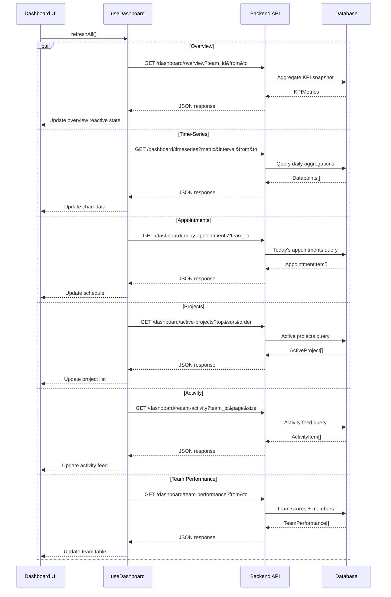
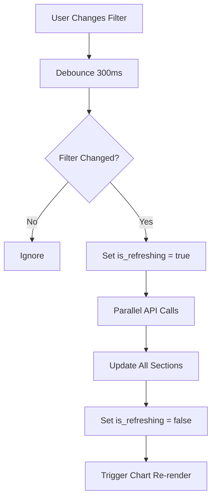

# Dashboard v2 - Integration Guide

## 🤝 Frontend-Backend Coordination Guide

**Module**: `crm`  
**Integration Type**: Frontend-driven with backend API coordination  

## 📋 Integration Overview

### **Team Responsibilities:**

#### **Frontend Team (Current Repo)**
- UI/UX implementation with mock data
- Dashboard composable development
- E2E testing with mocked APIs
- Documentation updates
- User acceptance testing

#### **Backend Team (Separate Repo)**
- API specification implementation
- Database schema creation
- KPI calculation business logic
- Performance optimization (aggregation queries)
- Unit/integration testing

## 🔄 Integration Workflow

### **Phase 1: API Specification Agreement**

#### **1.1 Frontend Deliverables:**
```
✅ Complete API specification (02-API-SPECIFICATION.html)
✅ UI mockups with interaction flows (03-UI-MOCKUPS.html)
✅ Business logic requirements (05-BUSINESS-LOGIC.html)
✅ Database schema recommendations (04-DATABASE-SCHEMA.html)
```

#### **1.2 Backend Review Process:**
```
📋 Backend team reviews API specification
📋 Database schema validation
📋 KPI calculation formula verification
📋 Performance requirements assessment
📋 Security considerations review
📋 API specification approval/modifications
```

#### **1.3 Coordination Checkpoints:**
- [ ] All 6 API endpoints structure approved
- [ ] Request/response formats confirmed
- [ ] KPI calculation formulas agreed
- [ ] Role-based access control strategy verified
- [ ] Performance benchmarks established
- [ ] Team IDs and mappings confirmed

### **Phase 2: Parallel Development**

#### **2.1 Frontend Development (Mock-First)**

Frontend team develops with mock data, implementing the `useDashboard` composable with a mock fallback pattern:

```typescript
// ui/composables/useDashboard.ts
export function useDashboard() {
  const { $callGet } = useNuxtApp()
  const config = useRuntimeConfig()
  
  const is_load = ref(false)
  const is_refreshing = ref(false)
  const error = ref<string | null>(null)
  
  const overview = ref<KPIMetrics | null>(null)
  const timeseries = ref<TimeSeriesDatapoint[]>([])
  const appointments = ref<AppointmentItem[]>([])
  const activeProjects = ref<ActiveProject[]>([])
  const activityFeed = ref<ActivityItem[]>([])
  const teamPerformance = ref<TeamPerformance[]>([])
  
  const filter = ref<DashboardFilter>({
    teamId: null,
    dateFrom: getStartOfMonth(),
    dateTo: getToday()
  })
  
  async function loadOverview() {
    const params = new URLSearchParams()
    if (filter.value.teamId) params.set('team_id', String(filter.value.teamId))
    if (filter.value.dateFrom) params.set('from', filter.value.dateFrom)
    if (filter.value.dateTo) params.set('to', filter.value.dateTo)
    
    try {
      const response = await $callGet(`/crm/${config.public.api_version}/dashboard/overview?${params}`)
      if (response?.status) {
        overview.value = response.data
      }
    } catch (e) {
      console.error('Failed to load dashboard overview:', e)
      error.value = 'โหลดข้อมูลภาพรวมไม่สำเร็จ'
    }
  }
  
  async function loadTimeSeries(metric: string) {
    const params = new URLSearchParams({ metric })
    if (filter.value.teamId) params.set('team_id', String(filter.value.teamId))
    if (filter.value.dateFrom) params.set('from', filter.value.dateFrom)
    if (filter.value.dateTo) params.set('to', filter.value.dateTo)
    
    try {
      const response = await $callGet(`/crm/${config.public.api_version}/dashboard/timeseries?${params}`)
      if (response?.status) {
        timeseries.value = response.data.datapoints
      }
    } catch (e) {
      console.error('Failed to load time-series:', e)
    }
  }
  
  async function loadTodayAppointments() {
    const params = new URLSearchParams()
    if (filter.value.teamId) params.set('team_id', String(filter.value.teamId))
    
    try {
      const response = await $callGet(`/crm/${config.public.api_version}/dashboard/today-appointments?${params}`)
      if (response?.status) {
        appointments.value = response.data
      }
    } catch (e) {
      console.error('Failed to load appointments:', e)
    }
  }
  
  async function loadActiveProjects() {
    const params = new URLSearchParams({ top: '5', sort: 'created_at', order: 'desc' })
    if (filter.value.teamId) params.set('team_id', String(filter.value.teamId))
    
    try {
      const response = await $callGet(`/crm/${config.public.api_version}/dashboard/active-projects?${params}`)
      if (response?.status) {
        activeProjects.value = response.data
      }
    } catch (e) {
      console.error('Failed to load active projects:', e)
    }
  }
  
  async function loadActivityFeed() {
    const params = new URLSearchParams({ page: '1', size: '10' })
    if (filter.value.teamId) params.set('team_id', String(filter.value.teamId))
    
    try {
      const response = await $callGet(`/crm/${config.public.api_version}/dashboard/recent-activity?${params}`)
      if (response?.status) {
        activityFeed.value = response.data.activities
      }
    } catch (e) {
      console.error('Failed to load activity feed:', e)
    }
  }
  
  async function loadTeamPerformance() {
    const params = new URLSearchParams()
    if (filter.value.dateFrom) params.set('from', filter.value.dateFrom)
    if (filter.value.dateTo) params.set('to', filter.value.dateTo)
    
    try {
      const response = await $callGet(`/crm/${config.public.api_version}/dashboard/team-performance?${params}`)
      if (response?.status) {
        teamPerformance.value = response.data.teams
      }
    } catch (e) {
      console.error('Failed to load team performance:', e)
    }
  }
  
  async function refreshAll() {
    is_refreshing.value = true
    error.value = null
    
    await Promise.allSettled([
      loadOverview(),
      loadTimeSeries('revenue'),
      loadTodayAppointments(),
      loadActiveProjects(),
      loadActivityFeed(),
      loadTeamPerformance()
    ])
    
    is_refreshing.value = false
  }
  
  return {
    // State
    is_load,
    is_refreshing,
    error,
    overview,
    timeseries,
    appointments,
    activeProjects,
    activityFeed,
    teamPerformance,
    filter,
    // Methods
    refreshAll,
    loadOverview,
    loadTimeSeries,
    loadTodayAppointments,
    loadActiveProjects,
    loadActivityFeed,
    loadTeamPerformance
  }
}
```

#### **2.2 Mock Fallback Pattern**

For independent frontend development, a mock composable wraps the real one:

```typescript
// ui/composables/useDashboardWithMock.ts
import { mockDashboardData } from '@/mocks/dashboardMockData'

export function useDashboardWithMock() {
  const config = useRuntimeConfig()
  const useMock = config.public.useMockDashboard ?? true  // Feature flag
  
  if (useMock) {
    return {
      is_load: ref(false),
      is_refreshing: ref(false),
      error: ref<string | null>(null),
      overview: ref<KPIMetrics>(mockDashboardData.overview),
      timeseries: ref<TimeSeriesDatapoint[]>(mockDashboardData.timeseries),
      appointments: ref<AppointmentItem[]>(mockDashboardData.appointments),
      activeProjects: ref<ActiveProject[]>(mockDashboardData.activeProjects),
      activityFeed: ref<ActivityItem[]>(mockDashboardData.activityFeed),
      teamPerformance: ref<TeamPerformance[]>(mockDashboardData.teamPerformance),
      filter: ref<DashboardFilter>({ teamId: null, dateFrom: '2026-06-01', dateTo: '2026-06-30' }),
      refreshAll: async () => { /* mock: do nothing */ },
      loadOverview: async () => { /* mock: do nothing */ },
      loadTimeSeries: async () => { /* mock: do nothing */ },
      loadTodayAppointments: async () => { /* mock: do nothing */ },
      loadActiveProjects: async () => { /* mock: do nothing */ },
      loadActivityFeed: async () => { /* mock: do nothing */ },
      loadTeamPerformance: async () => { /* mock: do nothing */ }
    }
  }
  
  return useDashboard()
}
```

#### **2.3 Backend Development (Based on Spec)**
```sql
-- Database implementation
CREATE TABLE dashboard_kpi_snapshot (...);
CREATE TABLE activity_feed (...);
CREATE TABLE dashboard_team_scores (...);

-- API implementation
GET /crm/v2/dashboard/overview
GET /crm/v2/dashboard/timeseries
GET /crm/v2/dashboard/active-projects
GET /crm/v2/dashboard/recent-activity
GET /crm/v2/dashboard/today-appointments
GET /crm/v2/dashboard/team-performance
```

### **Phase 3: Integration Testing**

#### **3.1 API Contract Testing**
```typescript
// Contract tests to verify API compliance
describe('Dashboard v2 API Contract', () => {
  test('GET /overview returns correct KPI structure', async () => {
    const response = await $callGet('/crm/v2/dashboard/overview')
    
    expect(response.status).toBe(true)
    expect(response.data).toHaveProperty('visits')
    expect(response.data).toHaveProperty('customers')
    expect(response.data).toHaveProperty('revenue')
    
    // Validate nested structure
    expect(response.data.visits).toHaveProperty('total')
    expect(response.data.visits).toHaveProperty('completed')
    expect(response.data.visits).toHaveProperty('completionRate')
    expect(response.data.visits).toHaveProperty('byType')
    expect(response.data.visits.byType).toHaveProperty('call')
    expect(response.data.visits.byType).toHaveProperty('onsite')
    expect(response.data.visits.byType).toHaveProperty('other')
  })
  
  test('GET /timeseries returns paginated datapoints', async () => {
    const response = await $callGet('/crm/v2/dashboard/timeseries?metric=revenue&interval=daily')
    
    expect(response.status).toBe(true)
    expect(response.data).toHaveProperty('metric', 'revenue')
    expect(response.data).toHaveProperty('interval', 'daily')
    expect(Array.isArray(response.data.datapoints)).toBe(true)
    expect(response.data).toHaveProperty('summary')
    expect(response.data).toHaveProperty('pagination')
  })
  
  test('GET /team-performance returns all 4 teams', async () => {
    const response = await $callGet('/crm/v2/dashboard/team-performance')
    
    expect(response.status).toBe(true)
    expect(response.data.teams).toHaveLength(4)
    
    const teamNames = response.data.teams.map((t: any) => t.team_name)
    expect(teamNames).toContain('ปลีก(สนญ)')
    expect(teamNames).toContain('ปลีก(สันกำแพง)')
    expect(teamNames).toContain('โครงการ(งานขนาดใหญ่)')
    expect(teamNames).toContain('ส่งร้านค้า(ค้าช่วง)')
  })
})
```

#### **3.2 End-to-End Integration**
```typescript
// E2E tests with real backend
describe('Dashboard v2 Integration', () => {
  test('Complete dashboard load workflow', async ({ page }) => {
    // 1. Navigate to dashboard
    await page.goto('/dashboard')
    
    // 2. Verify all sections load from backend
    await expect(page.getByTestId('kpi-card-visits')).toBeVisible()
    await expect(page.getByTestId('kpi-card-customers')).toBeVisible()
    await expect(page.getByTestId('kpi-card-revenue')).toBeVisible()
    
    // 3. Verify today's appointments
    await expect(page.getByTestId('appointment-schedule')).toBeVisible()
    
    // 4. Verify chart renders
    await expect(page.getByTestId('timeseries-chart')).toBeVisible()
    
    // 5. Verify team performance
    await expect(page.getByTestId('team-performance-table')).toBeVisible()
  })
})
```

## 📊 Data Flow Architecture

### **Frontend → Backend Flow**



### **Filter Change Flow**



## 🧪 Mock Data Strategy

### **Frontend Mock Implementation**
```typescript
// ui/mocks/dashboardMockData.ts
export const mockDashboardData = {
  overview: {
    visits: {
      total: 156,
      completed: 124,
      planned: 180,
      completionRate: 68.89,
      byType: { call: 45, onsite: 62, other: 17 },
      avgDuration: 35
    },
    customers: {
      active: 89,
      newAcquired: 12,
      visitFrequency: 1.75,
      retentionRate: 94.2
    },
    revenue: {
      total: 2850000.00,
      target: 3500000.00,
      achievement: 81.43,
      perVisit: 18269.23,
      trend: 'up' as const
    }
  },
  timeseries: Array.from({ length: 30 }, (_, i) => ({
    date: `2026-06-${String(i + 1).padStart(2, '0')}`,
    value: Math.floor(Math.random() * 150000) + 30000,
    label: `${i + 1} มิ.ย. 69`
  })),
  appointments: [
    {
      id: 801, type: 'onsite', typeDisplay: 'เยี่ยมสถานที่',
      title: 'ประชุมติดตามงาน โครงการ ABC', customerName: 'บริษัท ABC จำกัด',
      customerPhone: '02-123-4567', projectId: 3150, projectName: 'WG-Server-098',
      teamName: 'โครงการ(งานขนาดใหญ่)', assignedTo: 'สมชาย ใจดี',
      startTime: '09:00', endTime: '11:00', status: 'pending' as const,
      location: 'ถ.รัชดาภิเษก แขวงดินแดง เขตดินแดง กรุงเทพฯ'
    },
    {
      id: 802, type: 'call', typeDisplay: 'โทรศัพท์',
      title: 'โทรติดตามยอดขาย', customerName: 'ห้างทองแจ๊คพ็อต',
      customerPhone: '08-1983-8838', projectId: null, projectName: null,
      teamName: 'ส่งร้านค้า(ค้าช่วง)', assignedTo: 'ประสิทธิ์ รวยเร็ว',
      startTime: '13:00', endTime: '13:30', status: 'completed' as const
    }
  ],
  activeProjects: [
    {
      id: 3150, code: 'PJ2024-0018', name: 'WG-Server-098',
      orgContactName: 'พจก.ร้อยรี. 999', teamName: 'โครงการ(งานขนาดใหญ่)',
      status: 'active', budget: 2500000, progress: 65,
      lastVisitDate: '2026-06-15'
    }
  ],
  activityFeed: [
    {
      id: 5001, type: 'visit_completed', title: 'เยี่ยมชมโครงการ WG-Server-098',
      description: 'พนักงานสมชาย เยี่ยมชมโครงการ ติดตั้งเซิร์ฟเวอร์',
      projectId: 3150, projectName: 'WG-Server-098', teamName: 'โครงการ(งานขนาดใหญ่)',
      userName: 'สมชาย ใจดี', timestamp: '2026-06-16T10:30:00.000+0700',
      timestampDisplay: 'วันนี้ 10:30 น.'
    }
  ],
  teamPerformance: [
    {
      teamId: 44, teamName: 'โครงการ(งานขนาดใหญ่)', teamColor: '#A855F7',
      metrics: {
        visits: { total: 42, completed: 36, planned: 45, completionRate: 80, byType: { call: 8, onsite: 25, other: 3 }, avgDuration: 45 },
        customers: { active: 18, newAcquired: 2, visitFrequency: 2.33, retentionRate: 95 },
        revenue: { total: 950000, target: 1200000, achievement: 79.17, perVisit: 22619, trend: 'up' as const }
      },
      members: [
        { userId: 301, name: 'ประสิทธิ์ รวยเร็ว', visitCount: 14, revenue: 480000, achievement: 95.0 }
      ],
      rank: 1, score: 82.3
    },
    {
      teamId: 1, teamName: 'ปลีก(สนญ)', teamColor: '#3B82F6',
      metrics: {
        visits: { total: 52, completed: 40, planned: 55, completionRate: 72.73, byType: { call: 15, onsite: 20, other: 5 }, avgDuration: 35 },
        customers: { active: 32, newAcquired: 5, visitFrequency: 1.63, retentionRate: 94 },
        revenue: { total: 850000, target: 1000000, achievement: 85.0, perVisit: 16346, trend: 'up' as const }
      },
      members: [
        { userId: 101, name: 'สมชาย ใจดี', visitCount: 15, revenue: 320000, achievement: 91.4 }
      ],
      rank: 2, score: 78.5
    },
    {
      teamId: 2, teamName: 'ปลีก(สันกำแพง)', teamColor: '#22C55E',
      metrics: {
        visits: { total: 38, completed: 30, planned: 40, completionRate: 75, byType: { call: 10, onsite: 15, other: 5 }, avgDuration: 32 },
        customers: { active: 22, newAcquired: 3, visitFrequency: 1.73, retentionRate: 92 },
        revenue: { total: 620000, target: 800000, achievement: 77.5, perVisit: 16316, trend: 'flat' as const }
      },
      members: [
        { userId: 201, name: 'ก้องเกียรติ มีทรัพย์', visitCount: 10, revenue: 210000, achievement: 70.0 }
      ],
      rank: 3, score: 72.1
    },
    {
      teamId: 4, teamName: 'ส่งร้านค้า(ค้าช่วง)', teamColor: '#F97316',
      metrics: {
        visits: { total: 24, completed: 18, planned: 30, completionRate: 60, byType: { call: 8, onsite: 6, other: 4 }, avgDuration: 28 },
        customers: { active: 17, newAcquired: 2, visitFrequency: 1.41, retentionRate: 88 },
        revenue: { total: 430000, target: 500000, achievement: 86.0, perVisit: 17917, trend: 'down' as const }
      },
      members: [
        { userId: 401, name: 'มานะ ขยันดี', visitCount: 8, revenue: 180000, achievement: 72.0 }
      ],
      rank: 4, score: 68.9
    }
  ]
}
```

## 🔌 API Client Implementation Pattern

### **Feature Flag Strategy**
```typescript
// Frontend feature flag in runtime config
// nuxt.config.ts
export default defineNuxtConfig({
  runtimeConfig: {
    public: {
      useMockDashboard: process.env.NUXT_PUBLIC_USE_MOCK_DASHBOARD === 'true' ?? true
    }
  }
})

// Conditional rendering
<DashboardV2 v-if="useDashboardV2" />
<DashboardV1 v-else />
```

### **Error Handling Strategy**
```typescript
const handleAPIError = (error: any, section: string) => {
  console.error(`Dashboard ${section} failed:`, error)
  
  if (error.status === 401) {
    toast.error('กรุณาเข้าสู่ระบบใหม่')
    navigateTo('/login')
  } else if (error.status === 403) {
    toast.error('คุณไม่มีสิทธิ์ในการเข้าถึงข้อมูลนี้')
  } else if (error.status === 400) {
    toast.error('ข้อมูลที่ส่งไม่ถูกต้อง กรุณาตรวจสอบช่วงวันที่')
  } else {
    toast.error(`โหลด${section}ไม่สำเร็จ กรุณาลองใหม่`)
  }
}
```

## 🚀 Performance Considerations

### **Frontend Optimization**

#### **1. Parallel Data Loading**
```typescript
// Load all dashboard sections in parallel
async function refreshAll() {
  is_refreshing.value = true
  error.value = null
  
  const startTime = performance.now()
  
  await Promise.allSettled([
    loadOverview(),
    loadTimeSeries('revenue'),
    loadTodayAppointments(),
    loadActiveProjects(),
    loadActivityFeed(),
    loadTeamPerformance()
  ])
  
  const loadTime = performance.now() - startTime
  console.debug(`Dashboard loaded in ${loadTime}ms`)
  
  if (loadTime > 2000) {
    console.warn('Dashboard load time exceeded 2s threshold')
  }
  
  is_refreshing.value = false
}
```

#### **2. Skeleton Loading for Each Section**
```vue
<template>
  <div class="dashboard-grid">
    <template v-if="is_refreshing">
      <LoadingSkeleton v-for="i in 3" :key="i" class="kpi-skeleton" />
    </template>
    <template v-else>
      <KPICard v-for="(kpi, key) in kpis" :key="key" :metric="kpi" />
    </template>
  </div>
</template>
```

#### **3. Debounced Filter Changes**
```typescript
// Prevent rapid API calls during filter changes
const debouncedRefresh = useDebounceFn(async () => {
  await refreshAll()
}, 300)  // 300ms debounce

watch(() => [filter.value.teamId, filter.value.dateFrom, filter.value.dateTo], () => {
  debouncedRefresh()
}, { deep: true })
```

### **Backend Performance**

#### **Expected Performance Benchmarks:**
- **Overview Load**: <500ms for KPI aggregation
- **Time-Series Load**: <1s for 90-day daily data
- **Activity Feed Load**: <500ms for 20 items
- **Team Performance**: <1s for all 4 teams
- **Concurrent Users**: Support 100+ simultaneous dashboard views
- **Database Queries**: <3 queries per API call (using pre-aggregated tables)

#### **Optimization Strategies:**
```sql
-- Use materialized view for dashboard overview
REFRESH MATERIALIZED VIEW CONCURRENTLY mv_dashboard_monthly_kpi;

-- Partition activity_feed by month for faster range queries
CREATE TABLE activity_feed_y2026m06 PARTITION OF activity_feed
    FOR VALUES FROM ('2026-06-01') TO ('2026-07-01');
```

## 🔧 Deployment Coordination

### **Deployment Sequence:**
1. **Database migrations** applied (new tables, indexes)
2. **Backend API** deployment first
3. **API testing** verification (contract tests)
4. **Frontend deployment** with `useMockDashboard: true` feature flag
5. **Switch to real API** by toggling `useMockDashboard: false`
6. **Gradual rollout** to users (team by team)
7. **Monitoring** and feedback collection

### **Feature Flag Strategy:**
```typescript
// Runtime config feature flag
const config = useRuntimeConfig()
const useMock = config.public.useMockDashboard ?? true
const isEnabled = config.public.features?.dashboardV2 === true

// Conditional routing
if (isEnabled && !useMock) {
  // Use real API
  navigateTo('/dashboard-v2')
} else if (isEnabled && useMock) {
  // Use mock data
  navigateTo('/dashboard-v2?mock=true')
} else {
  // Fallback to v1
  navigateTo('/dashboard')
}
```

### **Rollback Plan:**
```typescript
const rollbackToV1 = () => {
  // Disable V2 feature flag
  // Redirect users to V1 interface
  // Preserve V2 data for future use
  // No data loss as V2 is read-only dashboard
}
```

## 📋 Communication Protocol

### **Progress Updates:**
- **Daily standups**: Progress sync between teams
- **Weekly demos**: UI mockup → API integration progress
- **Milestone reviews**: Phase completion signoff
- **Issue tracking**: Shared Plane cards with updates

### **Issue Resolution:**
```
Priority Levels:
🔴 Blocker: API contract breaking changes, wrong KPI calculations
🟡 High: Performance issues, missing endpoints
🟢 Medium: Enhancement requests, minor bugs
🔵 Low: Documentation updates, nice-to-have features
```

---

**Integration Guide Version**: 1.0  
**Last Updated**: June 2, 2026  
**Coordination Status**: Ready for Backend Team Review  
**Next Milestone**: Phase 1 API Specification Agreement
