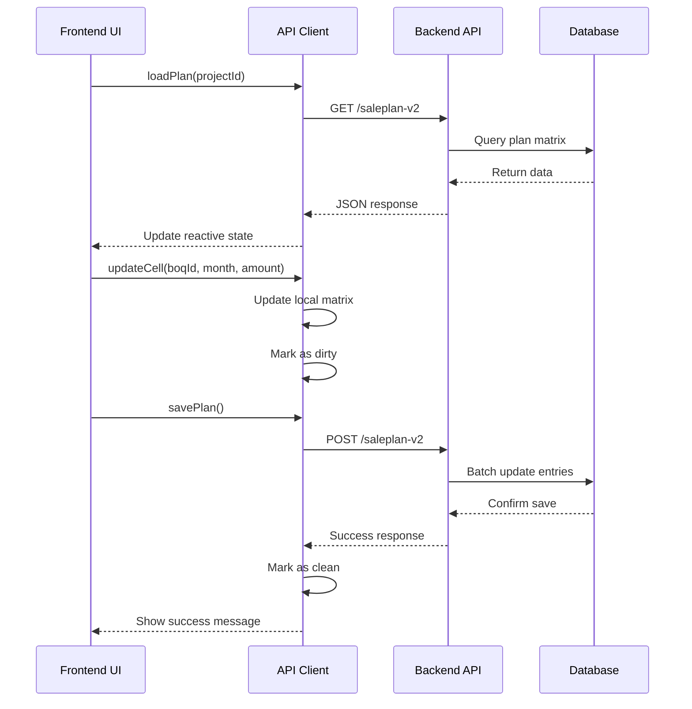
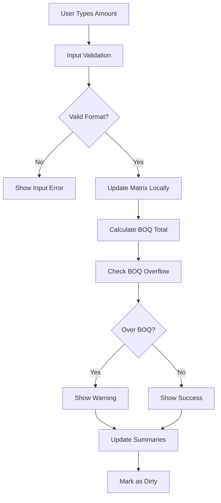

# Sale Plan v2 - Integration Guide

## 🤝 Frontend-Backend Coordination Guide

**Module**: `crm`  
**Integration Type**: Frontend-driven with backend API coordination  

## 📋 Integration Overview

### **Team Responsibilities:**

#### **Frontend Team (Current Repo)**
- UI/UX implementation
- API client integration
- E2E testing
- Documentation updates
- User acceptance testing

#### **Backend Team (Separate Repo)**
- API specification implementation
- Database schema creation
- Business logic validation
- Performance optimization
- Unit/integration testing

## 🔄 Integration Workflow

### **Phase 1: API Specification Agreement**

#### **1.1 Frontend Deliverables:**
```
✅ Complete API specification (02-API-SPECIFICATION.md)
✅ UI mockups with interaction flows (03-UI-MOCKUPS.md)  
✅ Business logic requirements (05-BUSINESS-LOGIC.md)
✅ Database schema recommendations (04-DATABASE-SCHEMA.md)
```

#### **1.2 Backend Review Process:**
```
📋 Backend team reviews API specification
📋 Database schema validation
📋 Performance requirements assessment
📋 Security considerations review
📋 API specification approval/modifications
```

#### **1.3 Coordination Checkpoints:**
- [ ] API endpoints structure approved
- [ ] Request/response formats confirmed
- [ ] Error handling strategy agreed
- [ ] Authentication/authorization verified
- [ ] Performance benchmarks established

### **Phase 2: Parallel Development**

#### **2.1 Frontend Development (Independent)**
```typescript
// Mock API implementation for development
const mockAPI = {
  async loadSalePlanMatrix(projectId: number): Promise<APIResponse<SalePlanV2Data>> {
    return {
      status: true,
      message: 'Mock data loaded',
      data: {
        planMatrix: generateMockMatrix(),
        timeline: generateMockTimeline(),
        boqItems: generateMockBOQs()
      }
    }
  }
}

// Real API client (same interface)
const realAPI = {
  async loadSalePlanMatrix(projectId: number): Promise<APIResponse<SalePlanV2Data>> {
    return await $callGet(`/crm/v2/projects/${projectId}/saleplan-v2`)
  }
}
```

#### **2.2 Backend Development (Based on Spec)**
```sql
-- Database implementation
CREATE TABLE saleplan_v2_headers (...);
CREATE TABLE saleplan_v2_entries (...);

-- API implementation
GET    /crm/v2/projects/{id}/saleplan-v2
POST   /crm/v2/projects/{id}/saleplan-v2  
PUT    /crm/v2/projects/{id}/saleplan-v2
DELETE /crm/v2/projects/{id}/saleplan-v2/{month}
```

### **Phase 3: Integration Testing**

#### **3.1 API Contract Testing**
```typescript
// Contract tests to verify API compliance
describe('Sale Plan v2 API Contract', () => {
  test('GET /saleplan-v2 returns correct structure', async () => {
    const response = await api.loadSalePlanMatrix(123)
    
    expect(response).toHaveProperty('status', true)
    expect(response.data).toHaveProperty('planMatrix')
    expect(response.data).toHaveProperty('timeline')
    expect(response.data).toHaveProperty('boqItems')
    
    // Validate data types and structure
    expect(response.data.planMatrix).toMatchObject({
      [expect.any(Number)]: {
        [expect.stringMatching(/^\d{4}-\d{2}$/)]: expect.any(Number)
      }
    })
  })
})
```

#### **3.2 End-to-End Integration**
```typescript
// E2E tests with real backend
describe('Sale Plan v2 Integration', () => {
  test('Complete planning workflow', async ({ page }) => {
    // 1. Load planning page
    await page.goto('/projects/123/edit?tab=plan-v2')
    
    // 2. Verify data loads from backend  
    await expect(page.getByText('งานโครงสร้าง')).toBeVisible()
    
    // 3. Edit planning data
    await page.getByRole('cell', { name: '2026-06' }).first().fill('300000')
    await page.getByRole('cell', { name: '2026-07' }).first().fill('400000')
    
    // 4. Save changes
    await page.getByRole('button', { name: 'บันทึกแผน' }).click()
    
    // 5. Verify backend persistence
    await page.reload()
    await expect(page.getByDisplayValue('300000')).toBeVisible()
    await expect(page.getByDisplayValue('400000')).toBeVisible()
  })
})
```

## 🔌 API Client Implementation

### **Frontend API Client Pattern**

#### **1. Composable Structure**
```typescript
// ui/composables/useSalePlanV2.ts
export function useSalePlanV2(projectId: number) {
  const { $callGet, $callPost, $callPut, $callDel } = useNuxtApp()
  const config = useRuntimeConfig()
  
  const planMatrix = ref<PlanMatrix>({})
  const timeline = ref<TimelineMonth[]>([])
  const boqItems = ref<BOQItemV2[]>([])
  const isLoading = ref(false)
  const isDirty = ref(false)
  
  const loadPlan = async () => {
    isLoading.value = true
    try {
      const response = await $callGet(`/crm/${config.public.api_version}/projects/${projectId}/saleplan-v2`)
      
      if (response?.status) {
        planMatrix.value = response.data.planMatrix || {}
        timeline.value = response.data.timeline || []
        boqItems.value = response.data.boqItems || []
      }
    } catch (error) {
      console.error('Failed to load Sale Plan v2:', error)
      toast.error('โหลดข้อมูลแผนการขายไม่สำเร็จ')
    } finally {
      isLoading.value = false
    }
  }
  
  const savePlan = async () => {
    if (!isDirty.value) return
    
    isLoading.value = true
    try {
      const response = await $callPost(`/crm/${config.public.api_version}/projects/${projectId}/saleplan-v2`, {
        planMatrix: planMatrix.value
      })
      
      if (response?.status) {
        isDirty.value = false
        toast.success('บันทึกแผนการขายสำเร็จ')
        
        // Update with response data if provided
        if (response.data?.validation_warnings?.length > 0) {
          showValidationWarnings(response.data.validation_warnings)
        }
      } else {
        toast.error(response?.message || 'บันทึกไม่สำเร็จ')
      }
    } catch (error) {
      console.error('Failed to save Sale Plan v2:', error)
      toast.error('บันทึกไม่สำเร็จ กรุณาลองใหม่')
    } finally {
      isLoading.value = false
    }
  }
  
  return {
    planMatrix,
    timeline,
    boqItems,
    isLoading,
    isDirty,
    loadPlan,
    savePlan
  }
}
```

#### **2. Error Handling Strategy**
```typescript
// Error handling with user-friendly messages
const handleAPIError = (error: any, operation: string) => {
  console.error(`Sale Plan v2 ${operation} failed:`, error)
  
  if (error.status === 401) {
    toast.error('กรุณาเข้าสู่ระบบใหม่')
    navigateTo('/login')
  } else if (error.status === 403) {
    toast.error('คุณไม่มีสิทธิ์ในการเข้าถึงข้อมูลนี้')
  } else if (error.status === 404) {
    toast.error('ไม่พบข้อมูลโครงการ')
  } else if (error.status === 422) {
    toast.error('ข้อมูลไม่ถูกต้อง กรุณาตรวจสอบอีกครั้ง')
    // Show specific validation errors if available
    if (error.data?.errors) {
      showValidationErrors(error.data.errors)
    }
  } else {
    toast.error(`${operation}ไม่สำเร็จ กรุณาลองใหม่`)
  }
}
```

## 📊 Data Flow Architecture

### **Frontend → Backend Flow**



### **Real-time Validation Flow**



## 🧪 Testing Coordination

### **Mock Data Strategy**

#### **Frontend Mock Implementation**
```typescript
// ui/mocks/salePlanV2Mock.ts
export const mockSalePlanV2Data = {
  planMatrix: {
    1: { "2026-06": 300000, "2026-07": 400000 },
    2: { "2026-06": 100000, "2026-07": 200000 }
  },
  timeline: [
    { value: "2026-06", name: "มิถุนายน 2569", displayShort: "มิ.ย. 69", isInProject: true },
    { value: "2026-07", name: "กรกฎาคม 2569", displayShort: "ก.ค. 69", isInProject: true }
  ],
  boqItems: [
    { id: 1, name: "งานโครงสร้าง", amount: 1500000, planned: 700000, remaining: 800000, percentage: 46.67 },
    { id: 2, name: "งานตกแต่งภายใน", amount: 800000, planned: 300000, remaining: 500000, percentage: 37.5 }
  ]
}
```

#### **Backend Mock Server** (For Integration Testing)
```javascript
// Mock server for frontend testing
const mockServer = {
  '/crm/v2/projects/:id/saleplan-v2': {
    GET: (req, res) => res.json({ status: true, data: mockData }),
    POST: (req, res) => {
      // Validate request structure
      const { planMatrix } = req.body
      // Simulate save and return success
      res.json({ status: true, message: 'Saved successfully' })
    }
  }
}
```

### **Contract Testing**

#### **API Contract Validation**
```typescript
// Shared contract validation
export interface APIContract {
  endpoints: {
    load: {
      method: 'GET'
      path: '/crm/v2/projects/{id}/saleplan-v2'
      response: SalePlanV2Response
    }
    save: {
      method: 'POST'
      path: '/crm/v2/projects/{id}/saleplan-v2'
      request: SavePlanRequest
      response: SavePlanResponse
    }
  }
}

// Frontend contract test
test('API responses match contract', () => {
  const response = mockAPI.loadSalePlanMatrix(123)
  expect(response).toMatchSchema(APIContract.endpoints.load.response)
})

// Backend contract test
test('API implements required endpoints', () => {
  expect(server.routes).toHaveEndpoint('GET', '/crm/v2/projects/:id/saleplan-v2')
  expect(server.routes).toHaveEndpoint('POST', '/crm/v2/projects/:id/saleplan-v2')
})
```

## 🚀 Performance Considerations

### **Frontend Optimization**

#### **1. Lazy Loading**
```typescript
// Large dataset handling
const useLazyMatrix = (projectId: number) => {
  const chunkSize = 1000 // Load BOQs in chunks
  
  const loadMatrixChunk = async (offset: number) => {
    const response = await $callGet(
      `/crm/v2/projects/${projectId}/saleplan-v2?offset=${offset}&limit=${chunkSize}`
    )
    return response.data
  }
  
  const loadAllChunks = async () => {
    // Progressive loading for large projects
  }
}
```

#### **2. Debounced Saves**
```typescript
// Prevent excessive API calls
const debouncedSave = useDebounceFn(async () => {
  await savePlan()
}, 2000) // Wait 2 seconds after last edit

watch(planMatrix, () => {
  isDirty.value = true
  debouncedSave()
}, { deep: true })
```

### **Backend Performance**

#### **Expected Performance Benchmarks:**
- **Load Time**: <2 seconds for 50 BOQs × 12 months
- **Save Time**: <3 seconds for complete matrix update  
- **Concurrent Users**: Support 50+ simultaneous edits
- **Database Queries**: <5 queries per API call
- **Memory Usage**: <100MB per active session

#### **Optimization Strategies:**
```sql
-- Database indexing for common queries
CREATE INDEX idx_saleplan_v2_project_lookup 
  ON saleplan_v2_entries(header_id, boq_item_id, month_period);

-- Prepared statements for batch updates
PREPARE batch_upsert_entries AS 
  INSERT INTO saleplan_v2_entries (...) 
  VALUES ($1, $2, $3, $4) 
  ON CONFLICT (...) DO UPDATE SET ...;
```

## 🔧 Deployment Coordination

### **Deployment Sequence:**
1. **Backend API** deployment first
2. **Database migrations** applied
3. **API testing** verification
4. **Frontend deployment** with feature flag
5. **Gradual rollout** to users
6. **Monitoring** and feedback collection

### **Feature Flag Strategy:**
```typescript
// Frontend feature flag
const useSalePlanV2 = () => {
  const config = useRuntimeConfig()
  return config.public.features?.salePlanV2 === true
}

// Conditional rendering
<SalePlanV2Tab v-if="useSalePlanV2()" />
<SalePlanV1Tab v-else />
```

### **Rollback Plan:**
```typescript
// Quick rollback capability
const rollbackToV1 = () => {
  // Disable V2 feature flag
  // Redirect users to V1 interface
  // Preserve V2 data for future use
}
```

## 📋 Communication Protocol

### **Progress Updates:**
- **Daily standups**: Progress sync between teams
- **Weekly demos**: UI mockup → API integration progress
- **Milestone reviews**: Phase completion signoff
- **Issue tracking**: Shared Plane cards with updates

### **Issue Resolution:**
```
Priority Levels:
🔴 Blocker: API contract breaking changes
🟡 High: Performance issues, major bugs
🟢 Medium: Enhancement requests, minor bugs
🔵 Low: Documentation updates, nice-to-have features
```

---

**Integration Guide Version**: 1.0  
**Last Updated**: June 1, 2026  
**Coordination Status**: Ready for Backend Team Review  
**Next Milestone**: Phase 1 API Specification Agreement